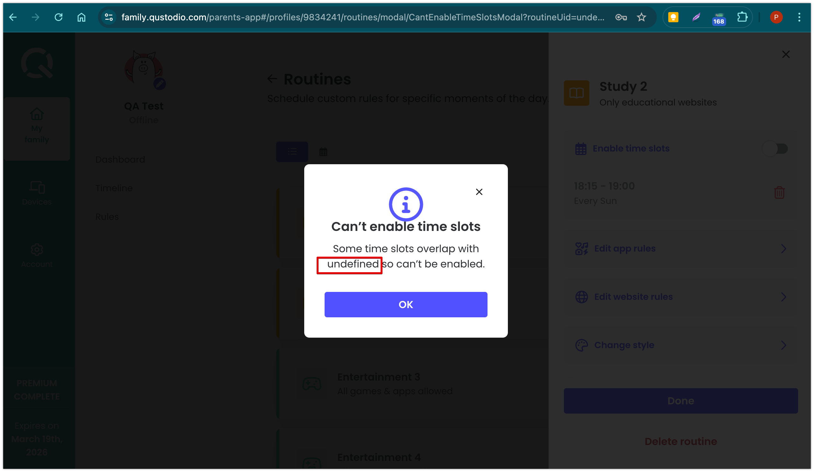

# Task 2: Bug Report

## Title

_**Text from warning message not correctly displayed.**_

## Description

Some text from the "Can't enable time slots" warning message attached is wrong. That message is displayed when trying to enable back time slots from a routine which overlaps with another existing routine. Specifically, the word `undefined` should be replaced by the related routine's name instead.

## Environment

- **Device:** MacBook Pro (Retina, 13-inch, Early 2015)
- **OS version:** macOS Monterey 12.7.6
- **Browser/version:** Chrome 134.0.6998.89 (Official Build) (x86_64)
- **URL visited:** https://family.qustodio.com/parents-app#/profiles/9834241/routines
- **Network Conditions:** Wi-Fi

## Severity / Priority

- **Severity:** Medium → Not severe impact on functionality.
- **Priority:** P3 → Not urgent for resolution.

## Steps to reproduce

1. Log into Qustodio app and choose the child you want to create a routine for.
2. Navigate to Rules and then Routines section.
3. Create a routine which contains one time slot at least.
4. On the same routine, disable time slots option.
5. Create another routine with a time slot which overlaps with the routine created previously.
6. Click on the routine created at step #3 and try to enable back the time slots option.
7. The warning message informing about the time slots overlapping should be displayed.

## Actual result

The message from the dialog box we are getting:
```
Some time slots overlap with "undefined" so can't be enabled.
```

## Expected result

The message displayed should be something like:
```
Some time slots overlap with "Study routine" so can't be enabled.
```

## Screenshots / Screen Recordings

- Screenshot attached:

 

- Link to download video: [bug-screencast.mp4](assets/bug-screencast.mp4)

## Logs or Console Errors

N/A

## Additional info

N/A
